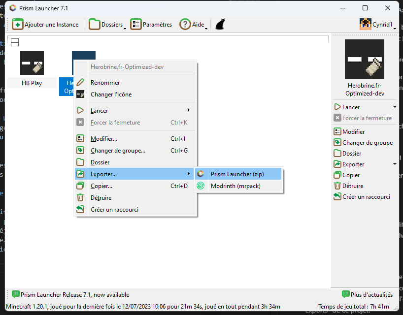

# Contribution

## Pré-requis:

- Installer python3.11.3
- Installer packwiz (https://packwiz.infra.link/installation/)
- Installer mmc-export==2.8.5
```
pip install mmc-export==2.8.5
```
- Installer modrinth pour python
```
pip install modrinth
```
- Installer le Prism Launcher
- Clonez forkez ce repository et clonez le

## Modifier et mettre à jour le modpack

Vous devez être à peu près familier avec le launcher Prism pour pouvoir éditer le modpack. L'aide du launcher peut vous être très utile: https://prismlauncher.org/wiki/help-pages/


### Créer l'instance de développement

Créez l'instance de développement à partir de la dernière version du modpack.


### Ajouts de mods

Le plus important à savoir pour les mods de l'instance c'est qu'il faut prioriser ceux qui ont pour source Modrinth. Les mods provenant d'autres sources demanderont d'autres précautions avant d'être installés.

#### Comment ajouter le mod dans chacun des deux cas:

>#### Ajout de mods Modrinth
>
>Le modpack est principalement hébergé sur Modrinth, ce qui implique que quasiment tous les mods du modpacks en dépendent aussi. Ainsi, si vous voulez ajouter un mod depuis modrinth, c'est plutôt simple: cliquez sur ajouter **Télécharger un mod** et cherchez le mod que vous voulez ajouter depuis l'interface.


>#### Ajouter un mod depuis une autre source
>
>Ajouter un mod depuis une autre source est plus compliqué. Comme le mod sera en dur dans le pack téléchargeable, cela équivaut à une redistribution du mod, et il faut alors vérifier la license d'utilisation de celui-ci.
<br>
>*TODO: Ajouter la méthode pour vérifier et ajouter la license*

### Mettre à jour les mods

Il est facile de vérifier et appliquer les mises à jour de mods grâce au bouton dédié. Il est cepdendant important de vérifier que tous les mods dans le pack sont activés (la case cochée dans la liste) avant de faire la mise à jour, car les mods désactivés risquent d'être dédoublés.

### Ajout ou modification de configuration par défaut

Dans les fichiers de l'instance, vous pouvez trouver le dossier **config/yosbr**. Ce dossier contient une arborescence de fichier par défaut à appliquer si jamais un de ces fichiers n'existe pas dans l'instance au moment du lancement du jeu. C'est donc là que se trouve la **Configuration par défaut** du modpack.

<br>

Pour l'éditer, il est conseillé de changer la configuration de minecraft depuis le jeu, puis aller chercher les fichiers de configuration modfifiés et les copier dans le répertoire correspondant sous le dossier yosbr.

### Suppression de mod

Un mod peut-être supprimé tant qu'aucun autre mod n'en dépend. Si vous effectuez une telle opération, n'oubliez pas de supprimer les fichiers de configuration par défaut asscoiés dans la dossier config/yosbr (ils peuvent être gardés si la suppression est temporaire).

## Release d'une version du modpack

### Vérifications et actions à effectuer avant l'export

#### Changement de la version affichée

La version du modpack est affichée dans le menu principal du jeu. Il faut la changer manuellement avant d'exporter le modpack en dehors du launcher. Voici comment faire:

1. Faire apparaitre la barre d'édition de Fancy Menu


2. Current Menu -> Layouts -> Manage layouts -> HerobrineMainMenu -> Edit


3. Clic droit sur le texte de version en bas à gauche, puis "Set Text Content"


4. Layout -> Save puis Layout -> Exit, sans oublier de refaire Ctrl + Alt + C avant de quitter pour désactiver la barre d'édition.

#### Vérification que la barre d'édition de FancyMenu est bien désactivée

Si une barre d'édition apparait au sommet du menu principal, désactivez la avec Ctrl + Alt + C.

#### Vérifier la configuration

- Vérifier qu'il n'y a aucun conflit de touches dans la configuration
- Pour que les modifications de configuration arrive à l'utilisateur finale, elles doivent être dans le dossier par défaut (changements de touches compris)

*TODO: Fichier répertoriant les configurations en dure et celles mises par défaut à vérifier (chaque mod concerné, placement des RP dans la liste, configuration des touches dans options.txt + fichier de config amecs, FancyMenu et autres mods avec config forcée...)*

#### Vérifier les packs de ressource

Avec tous les mods activés:

- Vérifier que les items de base du pack de ressource de Herobrine.fr fonctionnent (Example: Grande Torche, épées... ect)
- Vérifier que les items de pack de ressources ajoutés pour le modpack fonctionnent (Example: Lanterne)
- Vérifier que les packs de ressources ajoutés pour le modpack apparaissent bien à jour

#### Vérification du fonctionnement des mods

##### Général:
- Le jeu est jouable avec les performances attendues
- Les items dans les items frames prennent bien leur texture custom (exemple: Claymore)
- Le ciel est bien custom avec le pack de ressources (2 soleils)
- Bordures des vitres vitres non visibles quand groupées
- Vérifier que le menu ne comporte pas de bug en général sur les pages custom:
    - Les deux version des menus principaux
    - Le menu de pause du jeu (en particulier le bouton pour quitter)

##### FirstPersonModel, 3DSkinLayer, NEA:
- La première personne est bien celle du mod FirstPersonModel (on doit voir ses pieds en baissant la tête)
- Le skin apparait bien avec les textures 3D

##### CIT Resewn, Animatica, Entity Texture Feature, Entity Model Feature
- La texture de la grande torche fonctionne et **est animée**
- Le marcheur lunaire à bien sa texture et les bras repliés contre le corps

##### Clicthrought
- Clic droit sur un coffre caché par un panneau/item frame pour ouvrir le coffre
- Shift clic pour édition

##### Iris, Litematica, WorldEdit et WE CUI
- Vérifier que les changements de rendus d'aucun de ces mods ne fasse cracher ou buguer sévèrement le jeu

##### Stendhal
- Vérifier les interfaces d'édition des livres, enclumes, et autres
- Redémarrer le jeu sans advanced chat pour voir l'interface du chat

### Export de l'instance

Une fois toutes les vérifications effectuées, il vous faut exporter l'instance. La fonction export vous propose de filtrer les données que vous exportez, mais notre workflow inclue déjà une fonctionnalité de filtre dans une étape ultérieure, donc **exportez l'ensemble de l'instance** (laissez tout sélectionné). Le .zip qui en résultera doit être placé dans le dossier "exports" de ce projet.



Pour la suite, il faudra vous assurer que votre .zip est correctement nommé comme dans un des deux formats suivants:

Herobrine.fr-Optimized-x.x.x
<br>
Exemple: Herobrine.fr-Optimized-2.0.0

Herobrine.fr-Optimized-x.x.x-<alpha|beta>.x
<br>
Exemple: Herobrine.fr-Optimized-2.0.0-beta.1

### Création du modpack dans ses différents formats

#### Configuration

Dans le fichier config.json, vous pouvez décider du contenu de l'instance qui sera gardé lors de la création du modpack. Généralement, cela sert pour rajouter une configuration qui overridera ce qui se trouve dans l'instance de l'utlisateur final (on l'utilise pour la configuration de FancyMenu par exemple, qui n'est pas censée être changée par l'utilisateur, ou bien debugify parce que les options sont lues avant même le chargement des options par défaut, donc on ne peut pas le mettre dans le dossier config/yosbr de l'instance).

#### Ressources non sourcées du modpack

Les ressources incluent, mais ne s'y limitent pas: Pack de ressources, mods, Pack de Shaders... ect
Plus généralement, ce sont les contenus qui peuvent être uploadés en donnant seulement les références du projet associé sur Modrinth.

Dans notre cas, plusieurs de ces ressources n'ont pas de projet associé en ligne. C'est le cas de certains mods, selon l'état du modpack, mais aussi des ressources packs supplémentaires du modpack. Si vous avez besoin d'ajouter une telle ressource, cela se passe dans le Packwiz/mmc-export.toml. Vous pouvez prendre pour modèle les entrée déjà créées et vous fier la la [documentation](https://github.com/RozeFound/mmc-export#specify-source-url) de mmc-export.

#### Création du modpack

Finalement, il ne vous manque plus qu'à créer le modpack avec la commande suivante:

```
python ./modpack-creator.py <instance_export>
```

#### Push et pull request

Pushez vos modifications et faites une pull request décrivant vos changements sur le repository principal.